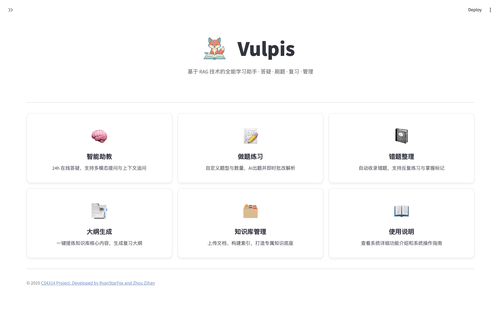
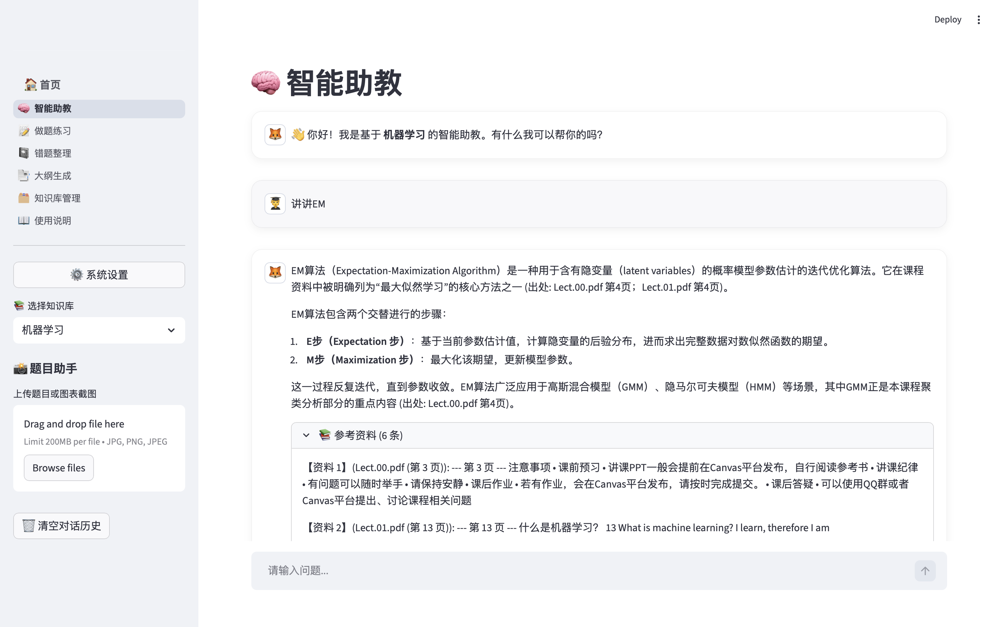
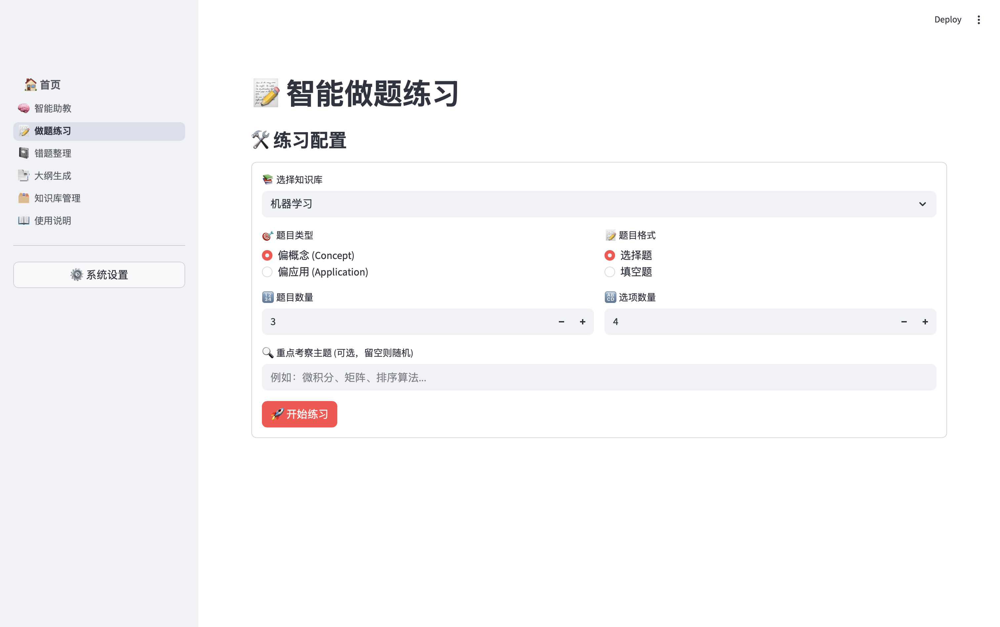
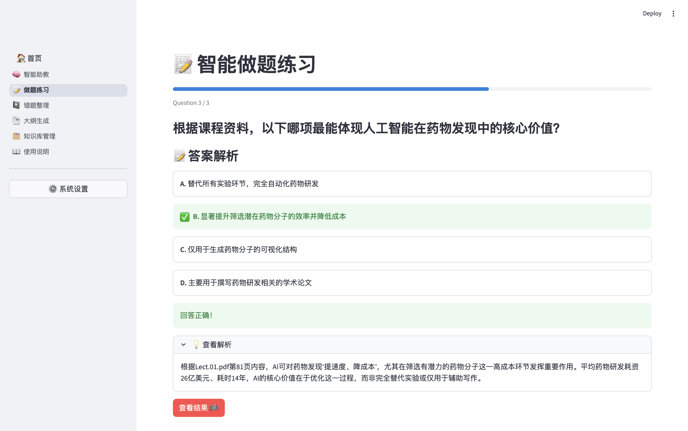
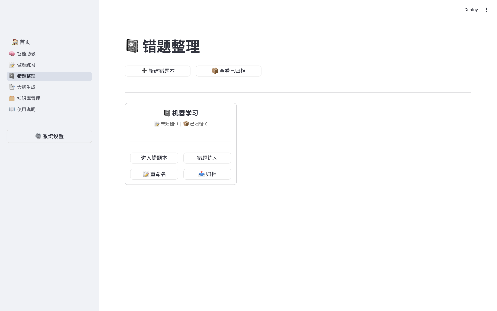
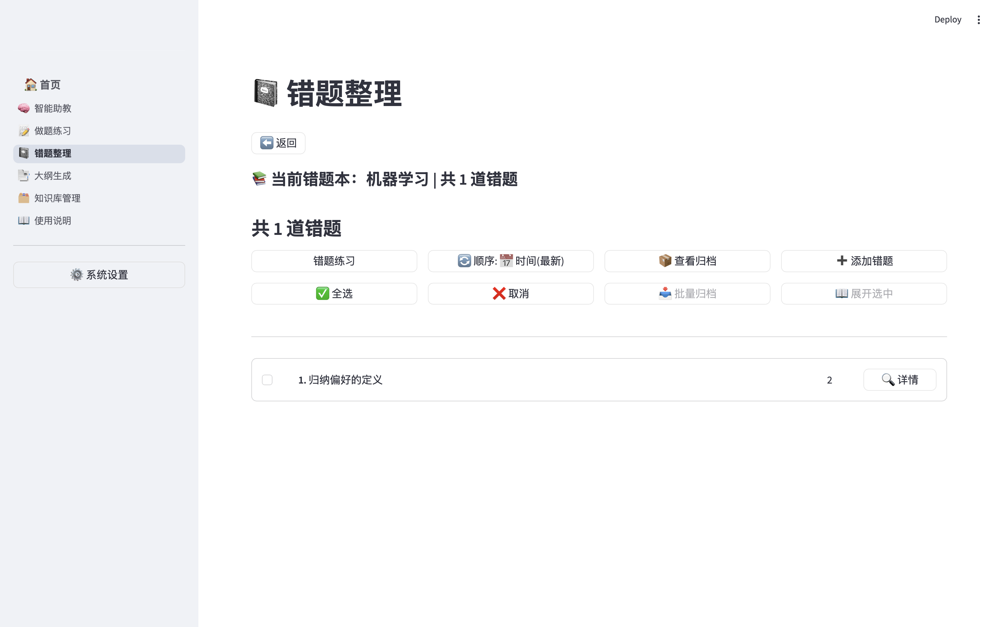
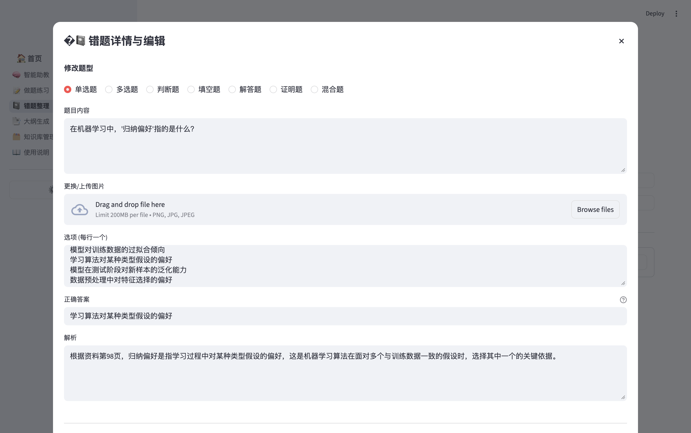
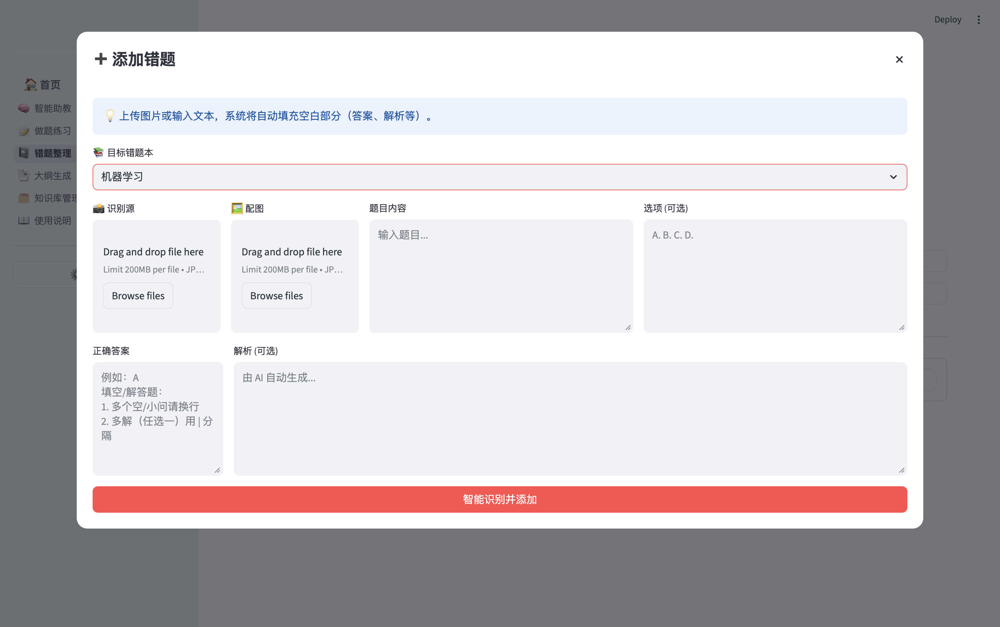
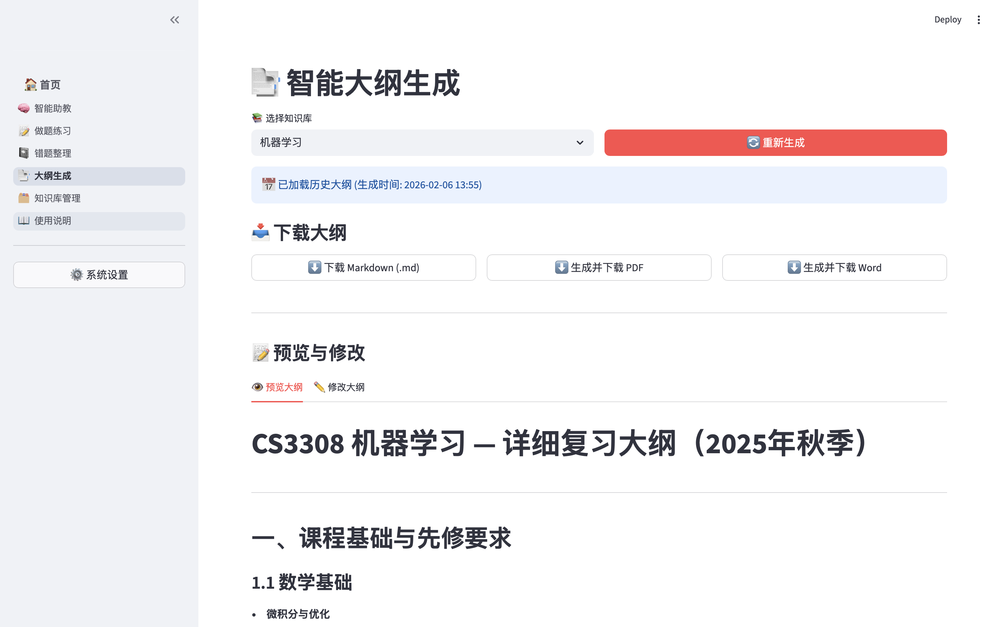
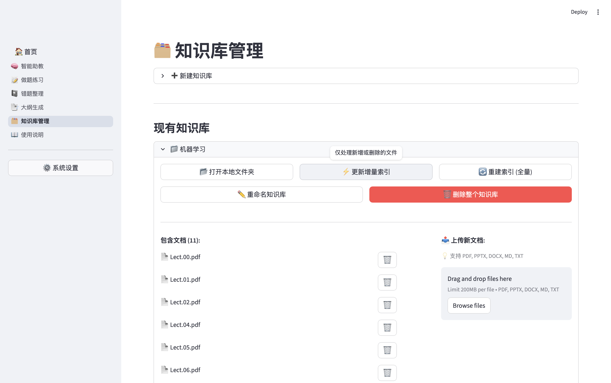

# CS4314 智能课程助教系统 (Vulpis)

<p align="center">
  
</p>

> 🚀 **快速开始**：请查看 [📖 详细安装与配置指南 (QUICKSTART.md)](QUICKSTART.md) 获取如何安装依赖、配置环境与启动应用的完整教学。

基于 RAG（检索增强生成）技术的智能课程助教系统，旨在为课程学习提供智能化的学习助手。支持文本和图片多模态提问、知识库检索和智能问答。

## 📚 目录

- [🕹️ 功能介绍与使用指南](#-功能介绍与使用指南)
- [🛠️ 技术栈](#-技术栈)
- [📁 项目结构](#-项目结构)
- [🔧 配置说明](#-配置说明)
- [❓ 常见问题 (FAQ)](#-常见问题-faq)

## 🕹️ 功能介绍与使用指南

本系统提供五大核心功能模块，通过 Web 界面即可轻松使用。

<p align="center">
  
  <br/>
  <em>主页界面</em>
</p>

### 1. 🧠 智能助教

**功能特性**：

- 24小时在线答疑，结合知识库上下文生成有依据的回答。
- 支持 **多模态输入**，可上传图片（如题目截图）进行视觉理解与解答。
- 支持 **多轮追问**，保持对话上下文连贯。

**使用方法**：

1. **选择知识库**：在页面顶部下拉框选择要咨询的课程知识库。
2. **提问/上传**：直接在输入框提问，或点击 📎 按钮上传图片。
3. **查看来源**：回答生成后，可展开下方的折叠块查看引用了哪些文档片段。

<p align="center">
  
  <br/>
  <em>智能助教 - 多模态问答</em>
</p>

### 2. 📝 做题练习

**功能特性**：

- **个性化出题**：支持自定义题型（概念辨析/应用计算）、题目数量和选项数。
- **AI 自动批改**：提交答案后立即判断对错，并基于知识点给出详细解析。
- **并行生成**：利用多线程技术快速生成多道题目。

**使用方法**：

1. **配置**：在侧边栏或顶部设置题目类型和数量。
2. **生成**：点击"开始生成"，系统将并行出题。
3. **作答**：逐一完成题目并提交，所有错题将自动进入错题本。

<p align="center">
  
  
  <br/>
  <em>做题练习 - 配置出题 & AI 批改解析</em>
</p>

### 3. 📓 错题整理

**功能特性**：

- **自动收录**：练习中做错的题目自动保存。
- **智能摘要**：AI 自动为错题生成一句话摘要，方便快速索引。
- **复习模式**：支持针对错题进行专项训练。
- **手动录入**：支持拍照上传线下错题，AI 自动转录。

**使用方法**：

1. **浏览**：在列表中查看所有错题。
2. **标记**：对于已掌握的题目，点击"标记为已掌握"将其归档。
3. **复习**：点击"开始复习模式"重新测试未掌握的错题。

<table align="center">
  <tr>
    <td align="center"><br/><em>错题本管理</em></td>
    <td align="center"><br/><em>错题列表</em></td>
  </tr>
  <tr>
    <td align="center"><br/><em>错题详情与编辑</em></td>
    <td align="center"><br/><em>手动添加错题</em></td>
  </tr>
</table>

### 4. 📑 大纲生成

**功能特性**：

- **智能提炼**：基于整个知识库的内容，自动梳理知识脉络，生成层级分明的复习大纲。
- **多格式导出**：支持导出为 **Markdown** 和 **PDF**。
- **完美渲染**：PDF 导出集成 Pandoc + LaTeX，完美支持中文排版与数学公式。

**使用方法**：

1. **生成**：点击生成按钮，等待 AI 分析文档。
2. **调整**：可以与 AI 对话微调大纲内容（Beta）。
3. **导出**：点击下载按钮获取文件。_(注：PDF 导出需系统安装 Pandoc)_

<p align="center">
  
  <br/>
  <em>大纲生成 - 智能提炼知识脉络</em>
</p>

### 5. 🗂️ 知识库管理

**功能特性**：

- **多库管理**：支持创建多个独立的知识库（如"数据结构"、"计算机网络"）。
- **多格式支持**：支持上传 PDF, PPTX, DOCX, TXT, MD。
- **自动处理**：上传即自动进行切分与向量化。
- **图像理解**：可选开启"课件图片理解"，让 AI 读懂 PPT 中的图表。

**使用方法**：

1. **新建**：输入名称创建新库。
2. **上传**：拖拽文件上传，进度条会显示处理状态。
3. **管理**：可随时删除过时的文档或重建索引。

<p align="center">
  
  <br/>
  <em>知识库管理 - 多库多文档管理</em>
</p>

---

## 🛠️ 技术栈

- **Python 3.10+**
- **Web 框架**：Streamlit
- **模型支持**：OpenAI 兼容接口 (支持 GPT-4o, Qwen-Max, GLM-4, DeepSeek 等)
- **向量数据库**：ChromaDB
- **文档处理**：PyPDF2, python-pptx, docx2txt, Pandoc
- **核心逻辑**：RAG 架构, 混合检索 (BM25 + Semantic), 异步处理
- **打包发布**：PyInstaller, GitHub Actions, Tauri

## 📁 项目结构

```text
.
├── app.py                 # Streamlit Web 应用入口
├── main.py                # 命令行交互入口
├── assets/                # 静态资源 (Logo, 字体)
├── core/                  # 核心业务逻辑包 (RAG, Database, Config 等)
├── pages/                 # Streamlit 功能页面
├── data/                  # 用户数据目录 (文档, SQLite 数据库)
├── vector_db/             # 向量索引存储
├── requirements.txt       # Python 依赖列表
└── QUICKSTART.md          # 快速上手指南
```

## 🔧 配置说明

本项目支持 **全界面化配置**。启动后点击 "**⚙️ 系统设置**" 即可修改所有参数，无需手动编辑配置文件。

主要可配置项：

| 参数         | 说明                                         |
| :----------- | :------------------------------------------- |
| **API 配置** | 模型名称 (Qwen/GPT)、API Key、Base URL       |
| **RAG 参数** | Top-K (检索数量)、混合检索权重、历史记忆轮数 |
| **文本处理** | 分块大小 (Chunk Size)、最大 Token 数         |
| **外部工具** | Pandoc 路径 (支持自动检测)                   |

## ❓ 常见问题 (FAQ)

### Q: PDF 导出失败？

**A:** 请确保已安装 Pandoc 和 LaTeX 环境。详见 `QUICKSTART.md`。

### Q: 知识库向量化很慢？

**A:** 首次上传大文件（如几百页的 PDF）需要较长时间进行 Embedding，请耐心等待。后续使用是毫秒级的。

### Q: 启动报错 `ModuleNotFoundError`?

**A:** 请确保已运行 `pip install -r requirements.txt`。如果是 `core` 模块报错，请确保在项目根目录运行 `streamlit run app.py`。
